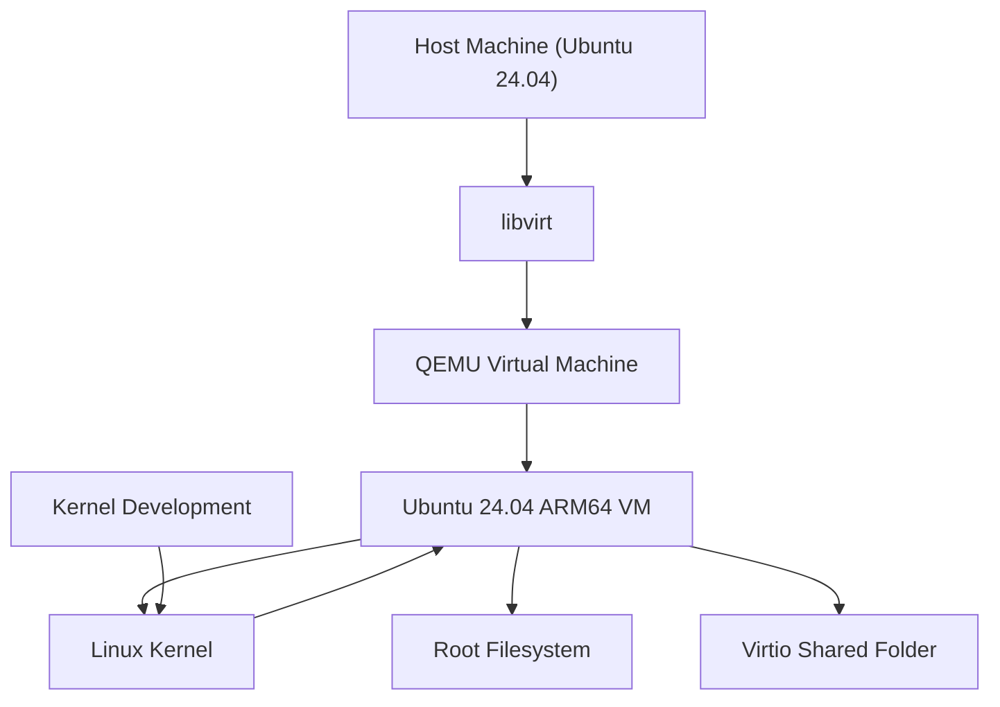

## Introduction

While starting my journey into Linux Kernel development, I quickly realized that having a safe and isolated testing environment is essential. Kernel development involves low-level system modifications, and mistakes can easily make an operating system unbootable.

For this reason, working inside a virtualized environment is the recommended approach. It allows developers to test kernel builds, experiment with modules, and debug system behavior without risking the stability of their host machine.

As part of the course **MAC0470/5856 – Linux Kernel Development**, offered at IME-USP, the program provides a sequence of tutorials designed to introduce students to the kernel development workflow. The first tutorial focuses on setting up a testing environment using **QEMU** and **libvirt**, which allows running virtual machines and booting custom kernels.

Although my professional background is primarily in **data engineering and cloud infrastructure**, exploring Linux Kernel development helps deepen my understanding of the systems that power distributed computing environments.

This post summarizes the setup process and highlights a few practical issues I encountered while following the tutorial available at:

[Setting up a test environment for Linux Kernel Dev using QEMU and libvirt](https://flusp.ime.usp.br/kernel/qemu-libvirt-setup/)

---

# Tutorial 1

## Setting Up a Test Environment for Linux Kernel Development Using QEMU and libvirt

The tutorial begins by explaining the importance of having a reproducible testing environment. When working with kernel development, the ability to quickly reboot a system, load a new kernel, and inspect logs is extremely valuable.

Using **QEMU** combined with **libvirt** makes this workflow easier by allowing developers to manage virtual machines and automate parts of the setup process.

---

## Architecture Overview

The environment created in the tutorial follows a simple architecture where the host machine controls a virtual machine running inside QEMU through libvirt.



In practice, this setup allows developers to compile kernels on the host machine and run them inside a controlled virtual machine.

---

## Installing Dependencies

The first step is installing all required packages.

Since my host system is **Ubuntu 24.04**, I followed the instructions for Debian-based distributions. The tutorial provides the necessary packages to install tools such as:

* QEMU
* libvirt
* virt-tools
* guest filesystem utilities

These tools allow interacting with virtual disk images, copying files into them, and controlling virtual machines.

---

## Preparing the Environment Script

One interesting design decision in the tutorial is the use of an **“all-in-one” configuration script**.

Instead of repeating commands manually, the script defines variables used throughout the setup process. This improves reproducibility and makes it easier to maintain the environment configuration.

Some examples of variables defined in the script include:

* the directory where VM images are stored
* the directory used to store boot artifacts
* configuration parameters used when creating the VM

This structure is helpful when working with multiple kernels or rebuilding the environment frequently.

---

## Difficulty Locating the System Image (Section 2.1)

While following **section 2.1**, I encountered some difficulty locating the system image used to create the virtual machine.

At the time of writing, I am using **Ubuntu 24.04**, and the image referenced in the tutorial was not immediately obvious. The documentation could benefit from a more explicit reference to the official cloud image repository.

The images can be found at:

https://cloud-images.ubuntu.com/releases/

Using a cloud image simplifies the setup because it is already optimized for virtualization environments.

---

## Extracting Kernel and initrd Files (Section 2.3)

Another part that required additional attention was **extracting the kernel and initrd from the VM image**.

The tutorial provides the following commands:

```bash
virt-copy-out --add "${VM_DIR}/arm64_img.qcow2" /boot/<kernel> "$BOOT_DIR"
```

and

```bash
virt-copy-out --add "${VM_DIR}/arm64_img.qcow2" /boot/<initrd> "$BOOT_DIR"
```

However, in order to determine the correct file names, it is necessary to list the contents of the VM filesystem using `virt-ls`.

The command suggested is:

```bash
virt-ls --add "${VM_DIR}/arm64_img.qcow2" --mount /dev/<rootfs> /boot
```

Initially, I assumed the root filesystem contained the `/boot` directory. However, after inspecting the disk partitions, I realized that:

* the **root filesystem was located at `/dev/sda3`**
* the **boot partition was located at `/dev/sda2`**

Because of this, the command did not return the expected files until I mounted the correct partition.

This distinction between root and boot partitions can easily confuse users who are not familiar with disk layouts inside Linux images.

---

## Booting the Virtual Machine

After completing the setup process, I was able to boot the virtual machine and connect to it.

The output below shows the VM successfully running **Ubuntu 24.04 LTS on ARM64**.

```bash
Welcome to Ubuntu 24.04.4 LTS (GNU/Linux 6.8.0-101-generic aarch64)

System information as of Wed Mar 11 19:11:05 UTC 2026

System load:  0.42
Memory usage: 7%
IPv4 address for enp1s0: 192.168.122.155
```
---

## Distribution-Specific Differences

Another detail worth mentioning is that some commands may vary depending on the Linux distribution being used.

For example, the tutorial uses:

```bash
systemctl restart sshd
systemctl status sshd
```

However, on **Ubuntu at least**, the SSH service is typically named:

```bash
systemctl restart ssh
systemctl status ssh
```

These small differences can generate confusion when following tutorials written for slightly different environments.

---


## What I Learned

Setting up this environment helped me understand several important concepts related to Linux systems and kernel development.

### Kernel development requires an isolated environment

Testing kernel modifications directly on the host system is risky. Virtual machines allow fast reboots and safe experimentation without affecting the main operating system.

### Understanding disk partitions is important

During the setup process, I initially assumed the `/boot` directory was inside the root filesystem. However, the image contained a **separate boot partition**, which required mounting `/dev/sda2` instead of `/dev/sda3`.

This clarified how Linux systems often separate:

* root filesystem
* boot partition
* kernel and initrd files

### Tools like virt-ls and virt-copy-out are extremely useful

These tools allow interacting directly with VM disk images without booting them. This is particularly useful when extracting kernel artifacts such as:

* `vmlinuz`
* `initrd`

### Small distribution differences can affect commands

Some services have different names depending on the distribution. Understanding these differences helps avoid confusion when following tutorials written for other distributions.

### Virtualization tools simplify kernel experimentation

Combining **QEMU**, **libvirt**, and **virtiofs** creates a powerful development environment where it becomes easy to:

* boot custom kernels
* test modules
* debug kernel behavior

This setup will be the foundation for the next steps in the tutorial series, where I will begin experimenting with **simple kernel modules**.
