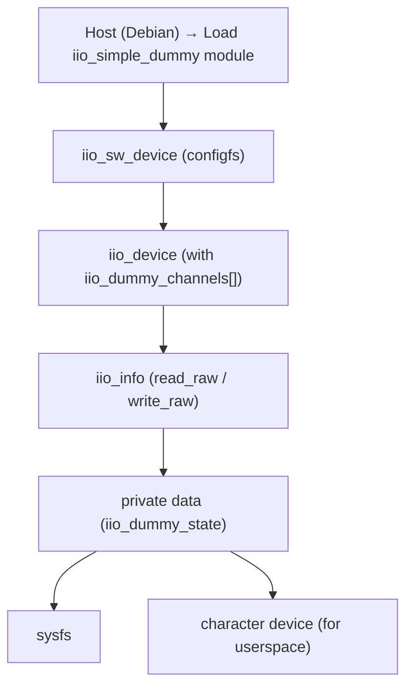

# Introduction

In the **MAC0470/5856 – Linux Kernel Development** course at IME-USP (and the FLUSP activities), the best way to understand a new subsystem is by dissecting a simple, well-commented example driver. For the **Industrial I/O (IIO)** subsystem, that driver is **`iio_simple_dummy`**.

This post is my personal study notes and explanations after going through the excellent [FLUSP tutorial "The iio_simple_dummy Anatomy"](https://flusp.ime.usp.br/iio/iio-dummy-anatomy/) by Rodrigo Siqueira. I followed the same systematic approach he recommends: find the initialization points, understand the core elements (especially channels), dissect the read/write functions, and then connect everything.

## Why `iio_simple_dummy` is the Perfect Learning Driver

- It is 100% software (no real hardware needed)
- Heavily commented in the kernel source (`drivers/iio/dummy/iio_simple_dummy.c`)
- Demonstrates almost every important IIO concept: channels, attributes, raw/scale/offset values, buffers, and events
- Lets you focus on the subsystem instead of bus-specific details (I2C/SPI/etc.)

## Architecture Overview

The dummy driver registers itself as a software IIO device, exposing simulated sensors to userspace.

## What I Learned

1. **Channels are everything** — almost all IIO magic lives in the `iio_chan_spec` array. Master this struct and you understand 80% of any IIO driver.
2. Separate vs shared masks are elegant: they keep the sysfs interface clean and avoid duplication.
3. Dummy drivers remove hardware noise — you can focus purely on the subsystem before touching real I2C/SPI sensors.
4. Read/write_raw are the bridge between kernel and userspace. They are simple once you see the `mask` + `chan` pattern.
5. The kernel community puts huge effort into documentation — the comments in `iio_simple_dummy.c` and the FLUSP tutorial are gold.