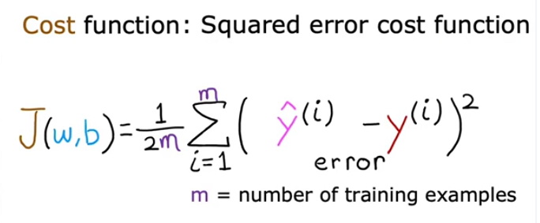
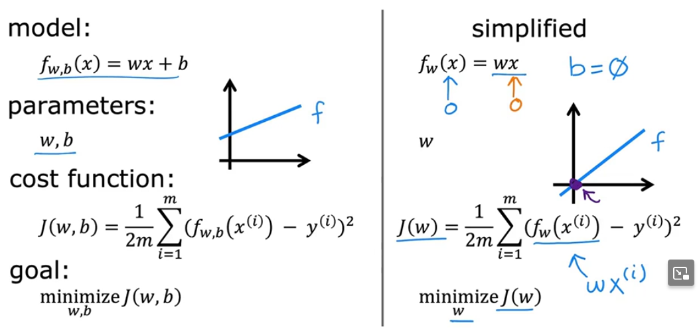

Imagine que você está tentando desenhar uma linha que melhor se encaixa em vários pontos espalhados em um gráfico. A função de custo é como uma régua que mede o quão longe essa linha está de cada ponto. Quanto menor essa medida, melhor a linha está ajustada aos dados.

Para entender isso, pense que cada ponto tem um valor real (o que queremos prever) e um valor que a linha prevê. A diferença entre esses dois valores é o erro. A função de custo pega esses erros, eleva ao quadrado (para evitar que erros positivos e negativos se cancelem) e calcula a média deles. Essa média é o número que queremos minimizar, ajustando a inclinação (w) e o ponto onde a linha cruza o eixo y (b), para que a linha fique o mais próxima possível dos pontos.

---

