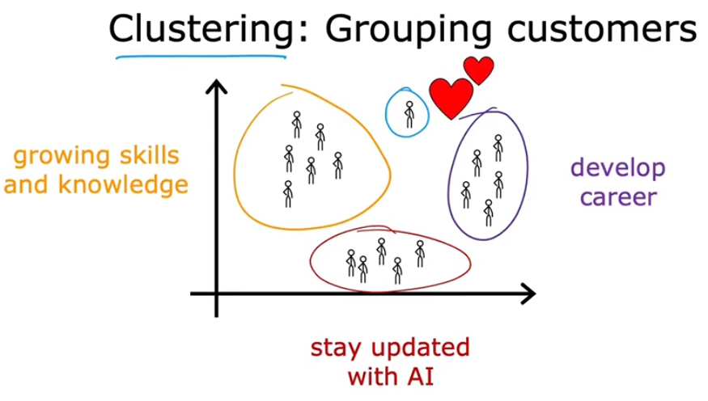

# Aprendizado não supervisionado 

Aprendizagem não supervisionada, recebemos dados que não estão associados a nenhum rótulo de saída Y. 
 
Exemplo:

​Por exemplo, imagine que você recebe dados de pacientes com o tamanho do tumor e a idade do paciente, mas sem ​saber se o tumor era benigno ou maligno,

Em vez disso, nosso trabalho é encontrar alguma estrutura, algum padrão ou simplesmente algo interessante nos ​dados. - ​Isso é Aprendizagem não supervisionada. ​

Chamamos de não supervisionado porque não estamos tentando supervisionar o algoritmo para dar uma suposta ​resposta certa para cada entrada. ​Em vez disso, pedimos para o algoritmo descobrir, por conta própria, o que é interessante ou quais padrões ou ​estruturas podem existir nesses dados. ​ATA UO REST ​Com esse conjunto de dados em particular, um algoritmo de Aprendizagem não supervisionada pode decidir que os ​dados podem ser atribuídos a dois grupos diferentes ou dois clusters diferentes. 

Aprendizagem não ​supervisionada os dados vêm apenas com as entradas X, mas sem os rótulos de saída Y, e o algoritmo precisa ​encontrar alguma estrutura, algum padrão ou algo interessante nos dados.

## Clustesrização

ele ​coloca os dados não rotulados em diferentes clusters, e isso acaba sendo usado em muitas aplicações.

Exemplo:

Google News - onde a manchete do artigo principal é: Panda gigante dá à ​luz gêmeos raros no zoológico mais antigo do Japão. Então, o algoritmo de agrupamento está encontrando artigos, dentre centenas de milhares de notícias na ​internet naquele dia, identificando os artigos que mencionam palavras semelhantes e agrupando-os em clusters.
O interessante é que esse algoritmo de agrupamento descobre sozinho quais palavras indicam que certos artigos ​pertencem ao mesmo grupo. ​O que quero dizer é que não há um funcionário do Google News dizendo ao algoritmo para encontrar artigos que ​tenham as palavras panda, gêmeos e zoológico para colocá-los no mesmo grupo. 

​Os temas das notícias mudam todos os dias e há tantas matérias que simplesmente não é viável ter pessoas ​fazendo isso diariamente para todos os assuntos que as notícias abordam. ​Em vez disso, o algoritmo precisa **descobrir sozinho, sem supervisão**, quais são os grupos de artigos de ​notícias do dia. 

​É por isso que esse algoritmo de agrupamento é um tipo de algoritmo de Aprendizagem não supervisionada. 

Resumo : algoritmo de clustering, que é um tipo de algoritmo de Aprendizagem não ​supervisionada, pega dados sem rótulos e tenta agrupá-los automaticamente em clusters.

---

## Detecção de Anomalias

---

## Redução de dimensionalidade
