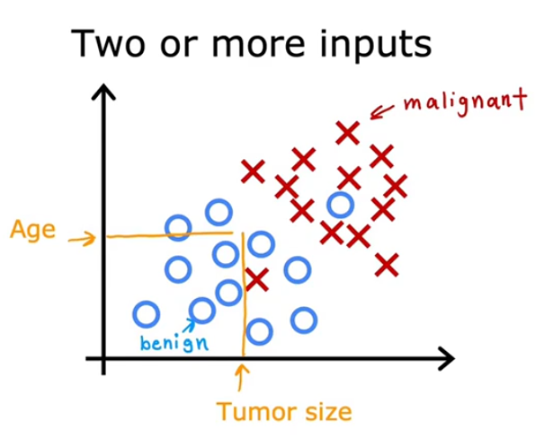

## Aprendizado de maquina supervisionado

Usada em aplicações do mundo real e aprensentado avanços e inovações mais rápido

Algoritmos que incluem respostas corretas

entrada X e saída Y

Algoritmo recebe só recebe entrada e costuma encontrar um valor y exato

---
ex:
    **entrada - saida (metodo)**
    email - spam ou não (spam filtering)
    audio - transcrição de texto (speech recognition)
    ingles - espanhol (machine translation)
    ad, user info - clique (online advertising)
    imagem, radar - posição de outros carros (carro autonomo)
    imagem de um celular - defeito? (visual inspection)

recebe entrada X e encontra um Y apropriado

---
Exemplo mais completo - Algoritmo de regressão:

O exemplo da casa ilustra o conceito de aprendizado supervisionado aplicado à previsão de preços imobiliários com base no tamanho da casa.

Exemplo de previsão de preço de casa

    Dados coletados mostram a relação entre o tamanho da casa (em pés quadrados) e o preço (em milhares de dólares).
    O algoritmo de aprendizado pode ajustar uma linha reta para os dados e estimar o preço de uma casa de tamanho específico, como 750 pés quadrados, resultando em uma previsão aproximada (exemplo: $150.000).

Modelos alternativos e complexidade

    Em vez de uma linha reta, o algoritmo pode ajustar uma curva ou uma função mais complexa para melhor representar os dados.
    A escolha do modelo adequado (linha reta, curva, etc.) é feita de forma sistemática para melhorar a precisão da previsão.

Esses passos demonstram como o aprendizado supervisionado usa exemplos com respostas corretas para treinar o modelo e depois prever preços para novos dados.

---

Classificação: Detecção de cancer de mama

Verifica se um tumor é maligno ou benigno

Uma razão pela qual isso é diferente de regressão é que estamos tentando prever apenas um pequeno número de ​possíveis saídas ou categorias. ​Neste caso, duas possíveis saídas, 0 ou 1, benigno ou maligno. ​Isso é diferente da regressão, que tenta prever qualquer número dentre uma quantidade infinita de possíveis ​números. ​E é justamente o fato de haver apenas duas possíveis saídas que faz disso uma classificação. 

A classificação é usada quando queremos prever uma categoria ou grupo específico, e não um número qualquer. Por exemplo, no diagnóstico de câncer de mama, o sistema precisa decidir se um tumor é benigno (não perigoso) ou maligno (canceroso). Aqui, só existem algumas opções possíveis, como "benigno" ou "maligno", ou até mais categorias, como diferentes tipos de câncer. É como separar frutas em caixas: maçãs vão para uma caixa, laranjas para outra, e assim por diante — não importa o tamanho da fruta, mas sim a qual grupo ela pertence.

# mais de um valor de entrada para saber a saída

Idade e tamanho do tumor

---

# Resumo 

Aprendizagem supervisionada mapeia a entrada X para a saída Y, onde o algoritmo de ​aprendizado aprende a partir das chamadas respostas corretas. ​Os dois principais tipos de Aprendizagem supervisionada são regressão e classificação. ​Em uma aplicação de regressão, como prever preços de casas, o algoritmo de aprendizado precisa prever números ​dentre infinitas possibilidades de valores de saída. ​Já na classificação, o algoritmo de aprendizado precisa prever uma categoria dentro de um pequeno conjunto de ​possíveis saídas. ​Então agora você já sabe o que é Aprendizagem supervisionada, incluindo tanto regressão quanto classificação 

---

# Regressão Linear

Ajustar uma linha reta em seus dados para fazer previsões numéricas.

Processo de aprendizado supervisionado

    O modelo é treinado com um conjunto de dados que contém entradas (exemplo: tamanho da casa) e saídas corretas (exemplo: preço da casa).
    O objetivo é aprender uma função que, dada uma nova entrada, possa prever a saída correspondente.

Exemplo prático: regressão linear para preço de casas

    Usando dados de casas em Portland, o modelo ajusta uma linha reta que relaciona o tamanho da casa ao preço.
    Para uma casa de 1250 pés quadrados, o modelo pode prever o preço aproximado com base na linha ajustada.

Conceitos e notação em aprendizado de máquina

    O conjunto de dados usado para treinar o modelo é chamado de conjunto de treinamento.
    A entrada é representada por x (feature), a saída por y (target), e o número total de exemplos por m.
    Cada exemplo de treinamento é indicado por (x^(i), y^(i)), onde i é o índice do exemplo no conjunto.

---

Modelo de regressão linear

    A função modelo pode ser representada como uma linha reta: f(x) = wx + b, onde w e b são parâmetros que determinam a previsão.
    Esse modelo é chamado de regressão linear univariada, pois usa uma **única variável de entrada** para prever o resultado.

Importância da função de custo

    Para ajustar o modelo aos dados, é necessário construir uma função de custo que mede o erro entre as previsões e os valores reais.
    A função de custo é fundamental para treinar modelos de aprendizado de máquina, incluindo regressão linear e modelos avançados de IA.

Para a regressão linear, o modelo é representado por fw,b(x)=wx+b. Qual das seguintes opções é a variável de saída ou "alvo"? y