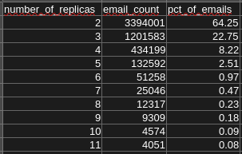
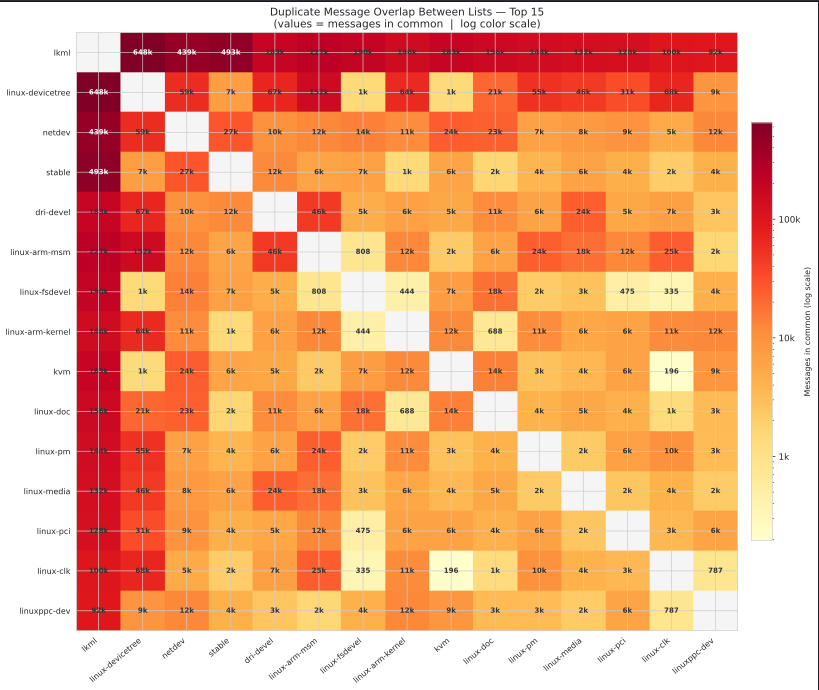

## Introduction

This post documents my contribution to [MailingListsHeritage](https://gitlab.com/ccsl-usp/codev/MailingListsHeritage), an open-source research project developed at the CCSL lab at USP. The project studies the heritage of free software communities through their mailing list archives.

My contribution is [!42 — feat(analysis): duplicate_messages](https://gitlab.com/ccsl-usp/codev/MailingListsHeritage/-/merge_requests/42), which introduces an analysis to identify and visualize duplicate messages across different mailing lists.

---

## The Problem

Free software mailing lists often serve overlapping communities. The same message can be forwarded or cross-posted to multiple lists — which raises interesting research questions: which lists share the most content? Is there a core set of messages that circulates broadly across communities?

Before this analysis, the project had no systematic way to measure this phenomenon.

---

## What I Built

The contribution produces two output artifacts:

### Replica Distribution (`output/analysis/replica_distribution.csv`)

I group messages by their `message_id` and `body_sha1` — a SHA-1 hash of the message body, which acts as a content fingerprint. From there, I generate a CSV showing how many times each message appears across different lists. This is the *replica distribution*.

Using the body hash rather than subject or sender was a deliberate choice: it identifies identical content regardless of metadata, which can vary between lists even for the same message.

### Overlap Heatmap (`output/analysis/duplicate_messages_heatmap_overlap.svg`)

Using the replica data, I generate an SVG heatmap showing the pairwise overlap of duplicate messages between the 15 most active lists. The color scale is logarithmic — without it, the most popular lists would dominate visually and obscure smaller but potentially significant overlaps.

---

## Contributing to an Existing Codebase

Contributing to an established project has its own learning curve. Before writing any code, I had to understand the repository structure, the naming conventions for output files, and how existing analysis scripts were organized — to keep everything consistent.

A few things I paid close attention to:

| Decision | Rationale |
|---|---|
| `body_sha1` as duplicate key | Deterministic content identity, independent of metadata |
| Logarithmic color scale | Preserves visibility across very different overlap magnitudes |
| Top 15 lists only | Keeps the heatmap readable without losing the most relevant signal |
| SVG output format | Consistent with other visual outputs in the project |

---

If you are interested in the project or want to contribute, the repository is open at [gitlab.com/ccsl-usp/codev/MailingListsHeritage](https://gitlab.com/ccsl-usp/codev/MailingListsHeritage).